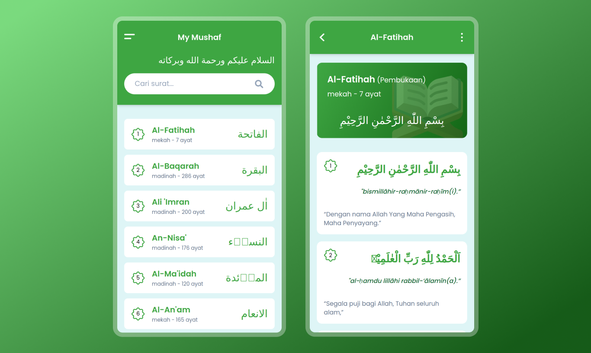

# Ngajee - Qur'an Digital Berbahasa indonesia

My Mushaf Indonesia adalah Aplikasi Al - Qur'an Digital Berbasis Website App, Sumber utama dari data yang terdapat pada Aplikasi ini adalah Aplikasi Qur'an Kementerian Agama Republik Indonesia dan audio dari Qur'an Central. Semoga dapat dimanfaatkan sebaik-baiknya.

## Table of contents

- [Ngajee - Aplikasi Al - Qur'an Digital Berbahasa indonesia](#my-mushaf-indonesia---aplikasi-al---quran-digital-berbahasa-indonesia)
  - [Table of contents](#table-of-contents)
  - [Overview](#overview)
    - [Screenshot](#screenshot)
    - [Features](#features)
    - [Links](#links)
  - [My process](#my-process)
    - [Built with](#built-with)
  - [Author](#author)

## Overview

### Screenshot

### Features

- Memiliki 114 Surat dan 30 Juz
- Terdapat Audio MP3 Murottal

### Links

- [Live](https://ngajee.web.id/)
- [Live in Netlify](https://mymushaf.netlify.app/)

## My process

### Built with

- NUXT
- TAILWIND CSS
- PROGRESSIVE WEB APP
- API [E-Quran](https://equran.id/apidev/v2),
